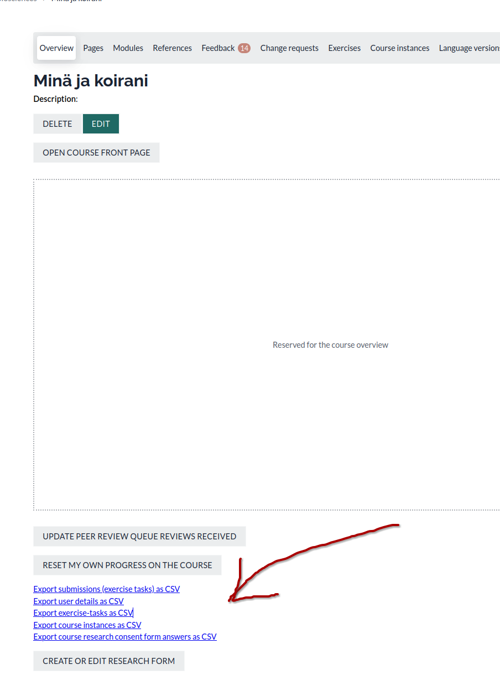
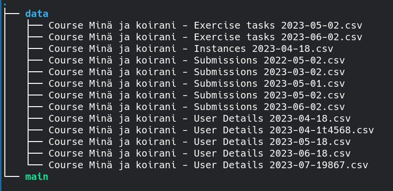
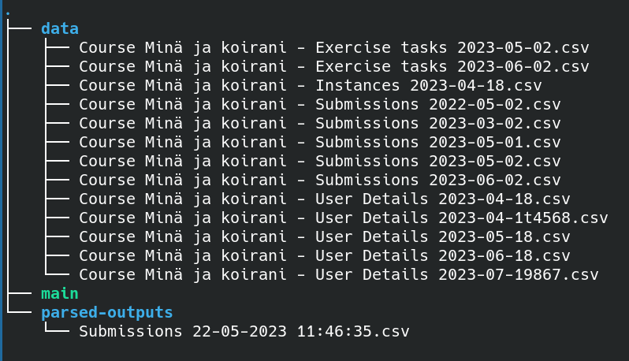
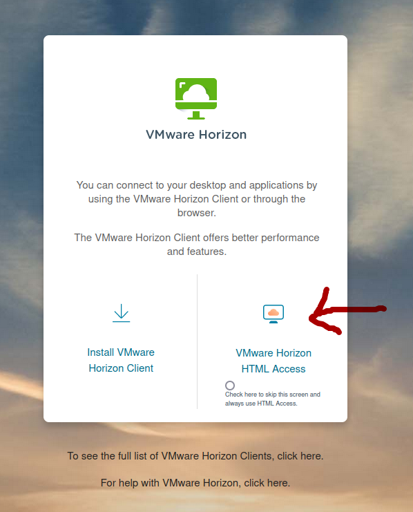
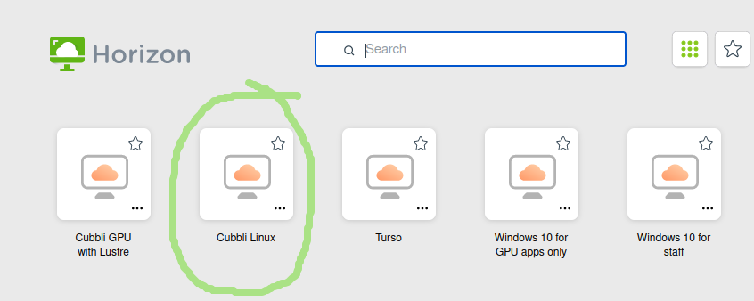
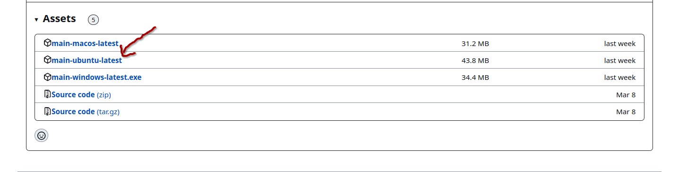
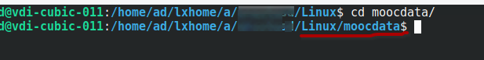
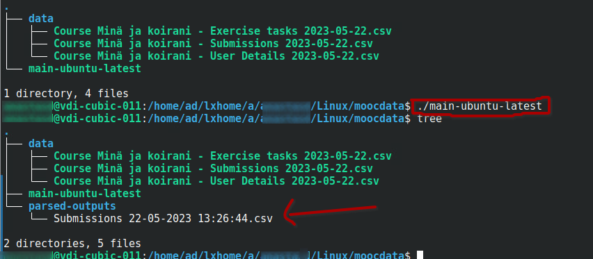

# Parsing the collected submissions on courses.mooc.fi

The output of the data-parser is a .csv file containing only answers to the `DOGS FACTORIAL ANALYSIS SURVEY` exercise types. The file will contain answers submitted **after** 22.05.2023 due to the latest format. The separator used in the .csv file is the semicolon `;`.

<!--- ```diff
%@@ Update March 2024: @@

%+ Support for parsing 'User Consents' files:
%columns named by the 'question' field, containing  true or false indicating whether a user checked the acceptance box,
%are added as new columns to the final output .csv file.

%+ Output .csv file will contain the course name in question
%(if your 'data' file is contaminated with files from different courses, this will show in the file name)
%The parser chooses the latest version of each of the files containing 'Submissions', 'User Details',
%'Exercise tasks' and 'User Consents' in the file name, no matter the course name.

%! TODO: parser does not work correctly now that there are several modules containing identical questionLabels
%! Need to extract information about which exercises belong to which module and parse accordingly:
%row1: user_id_x, module_a,  answers
%row2: user_id_x, module_b,  answers
%! At this point exercises in different modules might overwrite each other -> no way to link the answers to the correct pet!
%``` -->


## Dataset layout

The file contains columns `user_id, name, email`, followed by a column per `questionLabel` existing in the course. Empty submissions (not answered questions) have empty entry-points.

## Multiple-choice questions

An exception to the above format are the multiple-choice questions. These questions are represented in the dataset as `"questionLabel option"` column per option that may be selected. The user answer is then represented as 1 for chosen option, 0 for not chosen option. If the user has not answered the given question at all, the fields are empty (null).

For submissions being collected across different _language versions_ it is adviced to `label` the multiple-choice options in the same manner as the questions. This allows easier combining of datasets from the different language courses, having the same column headers. The format is `label ; option text` where the text on the left-hand side of the semicolon `;` is used as the column header in the resulting dataset, while the text on the right is what is shown to the survey user. Only the first semicolon will be used as a separator, meaning the option text may contain arbitrary amount of semicolons if needed. In case no semicolon is found the full option text is used as the column header.

## Using the parser

In order to parse the collected submissions you need to download the files from the main course management page on courses.mooc.fi. The links to download the files are shown at the bottom of the picture



The csv file for course instances is not used in the process and may be skipped. The needed files are:

- submissions
- user details
- exercise-tasks

To download the data-parser go to github release page https://github.com/rage/factor-analysis-exercise-service/releases/tag/release and choose the execution file for your operative system.

The parser expects folder named `data` to contain the downloaded .csv files and being located in the same folder as it self. This is the directory structure:



where the green `main` is the executable program in question (will probably be called `main-[name of you os]-latest`).
The parser will use the latest versions of the .csv files if there are several versions available in the `data` folder as in the above example.

Open up a terminal and navigate to the directory with the execution file and the `data` folder. From that folder run the parser with

> `./name-of-executable`

The parser will create a `parsed-outputs` folder with the resulting .csv file:



You may have to give executuion right to the executable file with:

> `chmod +x name-of-executable`

## Executing on Cubbli machine using VMware Horizen Client from your browser

Go to https://vdi.helsinki.fi/. Choose `WMware Horizon HTML Access`:



Sign in with you `University of Helsinki` credentials.

Choose the `Cubbli Linux` desktop:



Download the files and and the executable as explained above.

> Open a browser in the VMware Client in you browser, remember you are accessing your helsinki Cubbli desktop through your bowser. Your keyboard may also be different layout than you are used to. Search for `Keyboard` in the menu and change the `Layout` to the wanted one. (For Finnish Layout you may also just run the command `setxkbmap fi` in the Konsole)

Choose the `main-ubuntu-latest` executable from the github release page:



Open up a `Konsole` (search for `Konsole` in the menu). Create a new folder where you are going to work with your files. Move the executable file to the folder. Additionally, create a subfolder named `data` and move all the downloaded .csv files there. In the `Konsole`, navigate to the folder with the executable file and the `data` folder using the `cd` (change directory) command:



The folder in question is named `moocdata` here, you can see the name of the direcotry you are in as the last name before the $-sign.

Executing the binary fila is done by running command

> `./main-ubuntu-latest`



You may need to add exucution rights to the executable program:

> `chmod +x main-ubuntu-latest`
