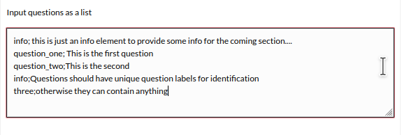
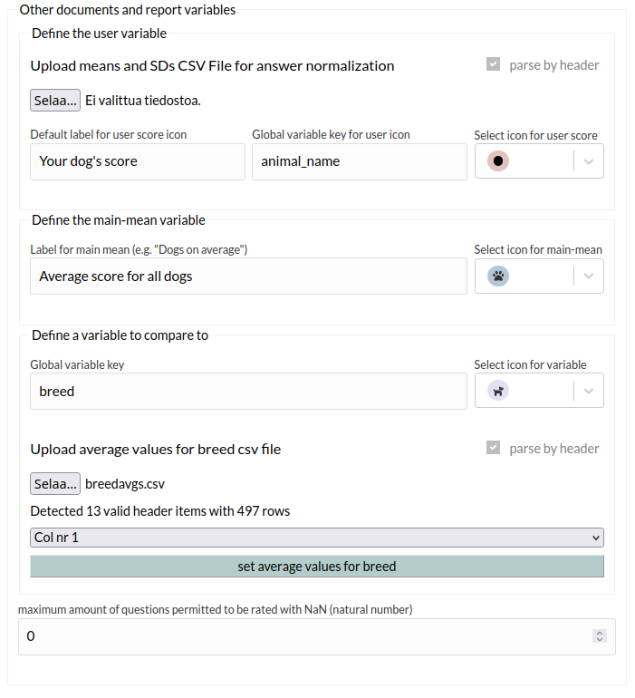
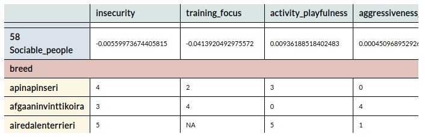
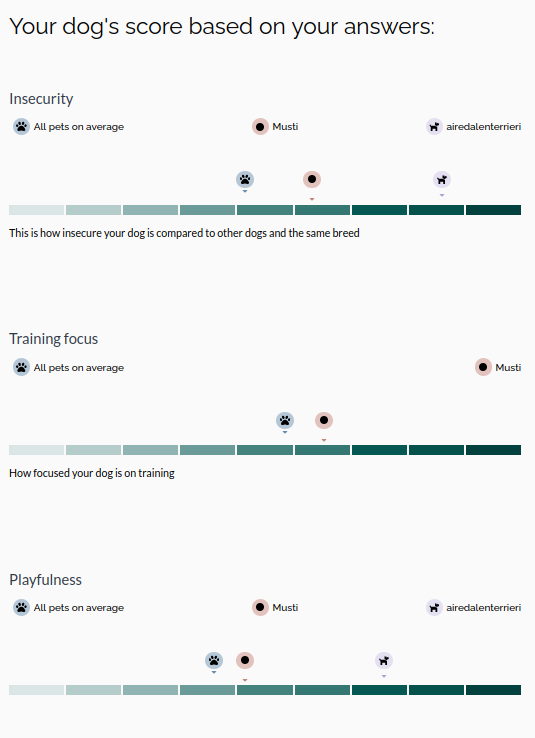

# User Manual

First select the appropriate exercise type from the exercise selector:


<p>&nbsp;</p>

### There are 2 types of surveys:

| factorial                                                                                                                                                                                                                                                         | non-factorial                                                                                                                                                                                                                                                                                                                                                            |
| ----------------------------------------------------------------------------------------------------------------------------------------------------------------------------------------------------------------------------------------------------------------- | ------------------------------------------------------------------------------------------------------------------------------------------------------------------------------------------------------------------------------------------------------------------------------------------------------------------------------------------------------------------------ |
| This survey type is meant for building the factorial survey type for calculating and outputting a factorial report to the user based on the user answers. It can also be used for a set of questions having the same answer options (single-choice). For example: | This survey type lets you create survey questions of type:                                                                                                                                                                                                                                                                                                               |
|                                                                                                                                                                   | <ul><li> free text</li><li> number</li><li>date</li><li>multiple-choice</li><li>single choice:<ul><li>radio-group</li><li>drop-down selection: the advanced drop-down selection allows the user to start typing in the search bar and provides answer alternatives matching the user input, in case of a very long option list.</li></ul></li><li>info element</li></ul> |

## Building a survey

<p>&nbsp;</p>

### General: editing survey questions

Survey questions are identified by their unique `labels`. The question is inputted in the format

> label; question text

where the label and the question text are separated by a `;` (semicolon). The label should _not_ contain any whitespace, the whitespaces will be automatically removed. Question editor supports markdown and the question text is rendered above the editor the same way it will be rendered in the actual survey.


<p>&nbsp;</p>

For the [**factorial**](#factorial-survey) survey the list of questions is inserted into the list editor in the format

> label_one; question one text \n other_label; other question text



The list can be modified to insert elements or remove elements from the list.

<p>&nbsp;</p>

> `Info` elements are labeled `info` and can be inserted anywhere into the list. Info elements do not have any answering option.


<p>&nbsp;</p>

> The [**non-factorial**](#non-factorial-survey) survey has the list insertion as an option only if the survey is empty.

<p>&nbsp;</p>

## Non-factorial survey

Either insert questions as a list to the list editor, or create a survey item one by one. Each question (survey item) is placed in its own box for editing. Once the label and question text are defined the selector for specifying the answer type will be rendered.


<p>&nbsp;</p>

### Adding answer options

For answer-types `multiple-choice`, `radio-group`, `dropdown-selection` and `advanced-dropdown` the options can be inserted one by one or as a .csv-file ([Comma Separated Values](https://en.wikipedia.org/wiki/Comma-separated_values)). The allowed delimiter for the .csv files are: `,` and `;`. Each value will be added as an option.

> After parsing the .csv file each option can still be edited or deleted manually as well as new options can be added. **Applying the .csv file will always overwrite any existing options.**

For options containing `,` either _escape_ the it by wrapping the option in double-quotes `""`, like so:

```
,option one,"option two, contains comma"
"option three"
```

yielding the following result:


Be careful with the no whitespaces between `"` (double-quote) and the preceding delimiter (in this case `,` (comma)).

By clicking the "duplicate item" button, a new survey item will be inserted below containing the same options and of the same answer-type. Once the question label is defined, the answer-selector will appear. You can freely switch between answer-types that contain options without losing your list of options. Choosing an answer type that does not contain options (text, number, date) will clear the list of options.

<p>&nbsp;</p>

### Making questions render conditionally

By ticking the box "Conditional" you can choose what condition the question will be rendered on. The condition is another question within the same `task` containing options. The conditional question will be rendered once the survey user selects that particular option from that question. Questions can be made "double conditional" (or triple and so on) by depending on other conditional questions.

<p>&nbsp;</p>

### Make global

By ticking the box "Make global" the answer of this question is made available for questions in other tasks of the same exercise type, for this particular course. Once the user has answered the "global" question her answer can be inputted into questions and info elements in other tasks using this format:

> ${question_label=default value}

where on the left hand side of `=` the `question_label` is the unique question label of the global question and on the right-hand-side `default value` is any value (text) that is rendered in case the user has not answered that question yet. The `default value` can be left empty.

### Duplicate item

The button `duplicate item` will create a new survey item below the given item with the exact same list of options. The question label and question text need still be defined. The list of options as well as the answer type can still be modified in both of the survey items independently.

<p>&nbsp;</p>

## Factorial survey

The factorial survey type is ment for a set of questions having same set of answer options. Based on the answers of a survey it is possible to calculate and provide a factorial report to the student upon submission based on static analysis numbers defined by the survey maker.


In order to build a factorial survey that calculates a factorial report, the survey maker has to define the following:

- set of [questions](#general-editing-survey-questions)
- set of answer [options](#options), mapped to a numerical value used in the calculation
- [factor weights matrix](#factor-weights-matrix) in the form:

|                    | factor_label $1$ | $$\dots$$  | factor_label $n$ |
| ------------------ | ---------------- | ---------- | ---------------- |
| question_label $1$ | $$a_{1,1}$$      | $$\dots$$  | $$a_{1,m}$$      |
| $$\vdots$$         | $$\vdots$$       | $$\ddots$$ | $$\dots$$        |
| question_label $n$ | $$a_{n,1}$$      | $$\dots$$  | $$a_{n,m}$$      |

The score for each factor $j$ is calculated by

$$
\begin{equation}
\text{factor}_j=\sum_{i=1}^{n}a_{i,j}x_i,
\end{equation}
$$

where $x_i$ is the numerical value associated with the answer that the survey user has chosen for question $i$.

> The matrix may be sparse and contain empty cells.

<p>&nbsp;</p>

**Additional _optional_ information can be provided:**

- normalization values: used to normalize the user answers
  $x_i = \dfrac{x_i - \mu_i}{scale_i}$ where $x_i$ is the rate given for question $i$, and $\mu_i$ and $scale_i$ are the values associated with the question $i$. The rates are scaled before the factorial calculation is performed by the above formula (1).
- information on a comparing variable [placeholder for link].
- Allowed amount of questions rated with `NaN`. That is, if some survey user chooses more than the allowed amount of `NaN`-options the factorial report will not be displayed and a failure message is rendered [link placeholder].

### Options

Options are added, edited and deleted in the `Options` section:


The numerical value associated with each answer option is defined in it's own box. Several options can have the same value, but the option texts have to differ. The numerical value will not be displayed in the actual survey, only the text inside the `Option text` editor will be displayed to the student. By leaving the `value` box empty, the option is mapped to a rating of `NaN`. Upon submission the `NaN` answers are imputed by the average $x_i =\dfrac{\mu - \mu}{scale} = 0$. If, during the survey answering, the amount of chosen `NaN` options exceeds some limit [link placeholder] set by the survey maker, factorial report will not be calculated.

> Ask group what to do when normalization values are not provided

### Factor weights matrix

Once the list of questions has been defined and the `Provide factor report to student` checkbox is checked it is time to define the factors of the survey by uploading a weight-matrix in a .csv file. The file parser will display the column headers in the `--select key column--` dropdown. Assign the column containing the `question_label`s of this survey as the `key-column`.


By clicking the `set factors` button, the file parser will read the file and display each factor for further editioning in its own editor box. If operation is successful the read matrix is displayed at the bottom of the `task-editor`. where the `factor_label`s are the column headers and the `question_label`s are rows.


Each column will be added as a factor and for each factor a factor-editor will appear:


- Name: is the title for the factor displayed to the user, the `factor_label` is not displayed.
- min and max are the minimal and maximal values a user can score for for a given factor. These values define the scale-line for the factor needed to correctly place the `user score` icon along it.
- factor average: is used to place the `average score` icon along the scale-line, in order to compare the user score with the average score. If not specified, the average will remain 0 (zero).
- Description: optional text to be rendered below the scale-line.

### Other documents and report variables



|                      | Define the user variables                                                                                                                                                                                                                                                                                                                                                                                                                                                                                                                                                                                                                                                  |
| -------------------- | -------------------------------------------------------------------------------------------------------------------------------------------------------------------------------------------------------------------------------------------------------------------------------------------------------------------------------------------------------------------------------------------------------------------------------------------------------------------------------------------------------------------------------------------------------------------------------------------------------------------------------------------------------------------------- |
| normalization values | _(Optional)_ normalization values are uploaded in the same way as the factor-weight values. On succesful parsing the values will be displayed in the same matrix as the factor-weights. If not defined the user answers will not be normilized and used in the calculations as is.                                                                                                                                                                                                                                                                                                                                                                                         |
| Label for user score | Here it is possible to insert a [global variable](#make-global), i. e. a user answer to a question somewhere else in this course ( preferrably earlier and in particular in a [non-factorial survey](#non-factorial-survey)) that is marked `global`. The `question_label` of the given question is given in the `Global variable key for user icon` text-box. In case the survey user does not have such a variable (has not answered and submitted the survey with the global question) a default value to be used is spesified in the `Default label for user score icon` text-box. The icon to represent the user score can be defined in the icon selection dropdown. |
|                      | **Define the main-mean variable**                                                                                                                                                                                                                                                                                                                                                                                                                                                                                                                                                                                                                                          |
| Label for main mean  | The main mean is defined in the same way as the user mean exept that there is no global varables to replace the name of the logo                                                                                                                                                                                                                                                                                                                                                                                                                                                                                                                                           |
|                      | **Define a variable to compare to**                                                                                                                                                                                                                                                                                                                                                                                                                                                                                                                                                                                                                                        |
| Define               | It is possible to define one more variable to compare the user to. This variable has to be defined as a global variable from an earlier non-factorial survey with the answering type of one of the [`single-choice`](#adding-answer-options) types. The `Global variable key` is again the `question_label` of the given question. Once this global `key` is defined a .csv file with the average values can be uploaded                                                                                                                                                                                                                                                   |
| Upload .csv          | The file upload is similar to the factor-weights upload. The columns are the `factor_label`s and the rows are the list of the possible `options` for the given global question defined above. On succesful parsing the preview-matrix will be extended witht the given rows                                                                                                                                                                                                                                                                                                                                                                                                |
|                      |                                                                                                                                                                                                                                                                                                                                                                                                                                                                                                                                                                                                                          |
| **Important**        | The `Global variable key` (in the above example "breed") must be defined before the file upload and will be rendered as a subheading in the display-matrix between the `question_label`s and the list of `options` for examination of the data. Uploading new files will overwrite the existing data. Some or all of the `options` may or may not have a defined average value for a given factor (empty cells or NaNs). In this case the factorial report will simply omit displaying the variable all together. The `options` must be in the same format as the list of `options` in the question marked `global`                                                        |
| example              |                                                                                                                                                                                                                                                                                                                                                                                                                                                                                                                                                                                                                             |
| **NaN** limit        | A numerical (natural number) value for the permitted amount of [`NaN`](#options)-options chosen before the report can no longer be calculated. By default this value is 0, meaning if not specified otherwise, report will no be calculated if any questions are reted with `NaN`.                                                                                                                                                                                                                                                                                                                                                                                         |
